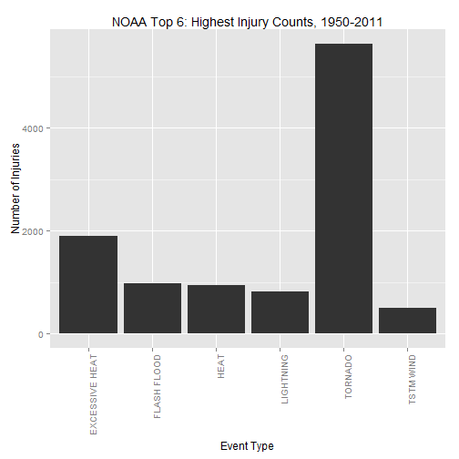

# Reproducible Research : Peer Assessment 2 - Analysing the NOAA Storm Database
===============================================================================
By:
*Nilesh Sawant*

## Synopsis

Storms and other severe weather events can cause both public health and economic problems for communities and municipalities. Many severe events can result in fatalities, injuries, and property damage, and preventing such outcomes to the extent possible is a key concern.

This project involves exploring the U.S. National Oceanic and Atmospheric Administration's (NOAA) storm database. This database tracks characteristics of major storms and weather events in the United States, including when and where they occur, as well as estimates of any fatalities, injuries, and property damage.


## Data Processing

### Read the data
* Save the file from in you local directory from [here](https://d396qusza40orc.cloudfront.net/repdata%2Fdata%2FStormData.csv.bz2)
* Load the data in the data_file object.


```r
data_file <- read.csv(bzfile("repdata-data-StormData.csv.bz2"), stringsAsFactors = FALSE)
```


```r
tidy_data <- data.frame(data_file$EVTYPE, data_file$FATALITIES, data_file$INJURIE, 
    data_file$PROPDMG, data_file$PROPDMGEXP, data_file$CROPDMG, data_file$CROPDMGEXP)
```

```
## Warning: Name partially matched in data frame
```

```r

# replace missing data with 0's
tidy_data$data_file.FATALITIES[(tidy_data$data_file.FATALITIES == "")] <- 0
tidy_data$data_file.INJURIES[(tidy_data$data_file.INJURIES == "")] <- 0
```

```
## Error: replacement has 0 rows, data has 902297
```

```r
tidy_data$data_file.PROPDMG[(tidy_data$data_file.PROPDMG == "")] <- 0
tidy_data$data_file.CROPDMG[(tidy_data$data_file.CROPDMG == "")] <- 0

tidy_data$data_file.PROPDMGEXP <- as.character(tidy_data$data_file.PROPDMGEXP)
tidy_data$data_file.CROPDMGEXP <- as.character(tidy_data$data_file.CROPDMGEXP)

# use a uniform numbers-only damage magnitude representation
tidy_data$data_file.PROPDMGEXP[(tidy_data$data_file.PROPDMGEXP == "")] <- 0
tidy_data$data_file.PROPDMGEXP[(tidy_data$data_file.PROPDMGEXP == "+") | (tidy_data$data_file.PROPDMGEXP == 
    "-") | (tidy_data$data_file.PROPDMGEXP == "?")] <- 1
tidy_data$data_file.PROPDMGEXP[(tidy_data$data_file.PROPDMGEXP == "h") | (tidy_data$data_file.PROPDMGEXP == 
    "H")] <- 2
tidy_data$data_file.PROPDMGEXP[(tidy_data$data_file.PROPDMGEXP == "k") | (tidy_data$data_file.PROPDMGEXP == 
    "K")] <- 3
tidy_data$data_file.PROPDMGEXP[(tidy_data$data_file.PROPDMGEXP == "m") | (tidy_data$data_file.PROPDMGEXP == 
    "M")] <- 6
tidy_data$data_file.PROPDMGEXP[(tidy_data$data_file.PROPDMGEXP == "B")] <- 9

tidy_data$data_file.CROPDMGEXP[(tidy_data$data_file.CROPDMGEXP == "")] <- 0
tidy_data$data_file.CROPDMGEXP[(tidy_data$data_file.CROPDMGEXP == "+") | (tidy_data$data_file.CROPDMGEXP == 
    "-") | (tidy_data$data_file.CROPDMGEXP == "?")] <- 1
tidy_data$data_file.CROPDMGEXP[(tidy_data$data_file.CROPDMGEXP == "h") | (tidy_data$data_file.CROPDMGEXP == 
    "H")] <- 2
tidy_data$data_file.CROPDMGEXP[(tidy_data$data_file.CROPDMGEXP == "k") | (tidy_data$data_file.CROPDMGEXP == 
    "K")] <- 3
tidy_data$data_file.CROPDMGEXP[(tidy_data$data_file.CROPDMGEXP == "m") | (tidy_data$data_file.CROPDMGEXP == 
    "M")] <- 6
tidy_data$data_file.CROPDMGEXP[(tidy_data$data_file.CROPDMGEXP == "B")] <- 9

tidy_data$data_file.PROPDMGEXP <- as.numeric(tidy_data$data_file.PROPDMGEXP)
tidy_data$data_file.CROPDMGEXP <- as.numeric(tidy_data$data_file.CROPDMGEXP)

total_damage <- tidy_data$data_file.PROPDMG * 10^tidy_data$data_file.PROPDMGEXP + 
    tidy_data$data_file.CROPDMG * 10^tidy_data$data_file.CROPDMGEXP
tidy_data <- cbind(tidy_data, total_damage)

sort_fatalities <- sort(tapply(tidy_data$data_file.FATALITIES, tidy_data$data_file.EVTYPE, 
    sum), decreasing = T)
sort_injuries <- sort(tapply(tidy_data$data_file.INJURIES, tidy_data$data_file.EVTYPE, 
    sum), decreasing = T)
```

```
## Error: arguments must have same length
```

```r
sort_evtype <- sort(tapply(tidy_data$total_damage, tidy_data$data_file.EVTYPE, 
    sum), decreasing = T)

```


## Results:

### Across the United States, which types of events (as indicated in the EVTYPE variable) are most harmful with respect to population health?
* First is Fatalities


```r
library(ggplot2)
names <- as.vector(names(head(sort_fatalities)))
values <- as.vector(head(sort_fatalities))
df <- data.frame(names, values)
ggplot(data = df, aes(x = df$names, y = df$values)) + geom_bar(stat = "identity") + 
    theme(axis.text.x = element_text(angle = 90, hjust = 1)) + xlab("Event Type") + 
    ylab("Number of Fatalities") + ggtitle("NOAA Top 6: Highest Fatality Counts, 1950-2011")
```

 


* Second is injuries


```r
names <- as.vector(names(head(sort_injuries)))
```

```
## Error: object 'sort_injuries' not found
```

```r
values <- as.vector(head(sort_injuries))
```

```
## Error: object 'sort_injuries' not found
```

```r
df <- data.frame(names, values)
ggplot(data = df, aes(x = df$names, y = df$values)) + geom_bar(stat = "identity") + 
    theme(axis.text.x = element_text(angle = 90, hjust = 1)) + xlab("Event Type") + 
    ylab("Number of Injuries") + ggtitle("NOAA Top 6: Highest Injury Counts, 1950-2011")
```

 


### Across the United States, which types of events have the greatest economic consequences?


```r
names <- as.vector(names(head(sort_evtype)))
values <- as.vector(head(sort_evtype))
df <- data.frame(names, values)
ggplot(data = df, aes(x = df$names, y = df$values)) + geom_bar(stat = "identity") + 
    theme(axis.text.x = element_text(angle = 90, hjust = 1)) + xlab("Event Type") + 
    ylab("Economic Damage ($)") + ggtitle("NOAA Top 6: Highest Damage (Property + Crop), 1950-2011")
```

 

