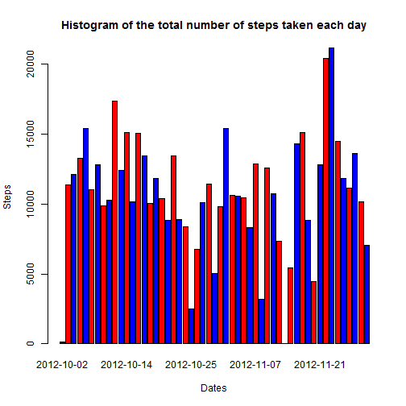
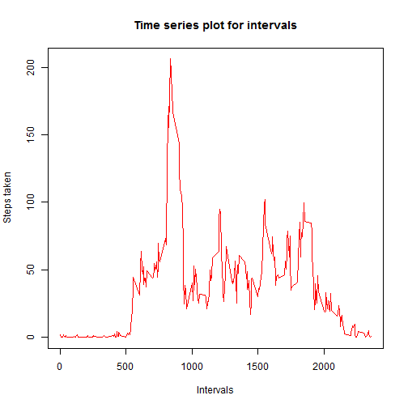
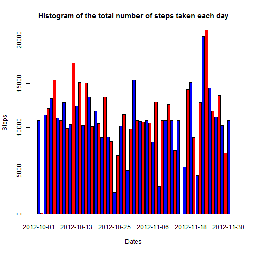
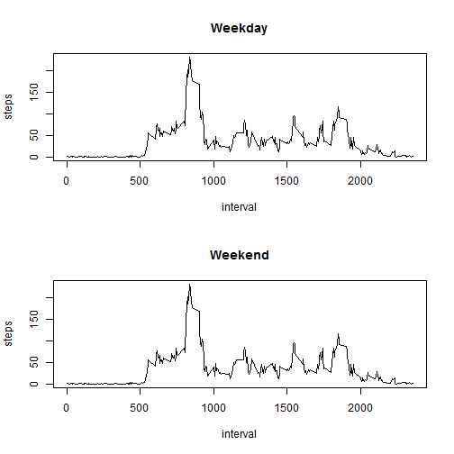

# Reproducible Research: Peer Assessment 1
========================================================
This assignment makes use of data from a personal activity monitoring device. This device collects data at 5 minute intervals through out the day. The data consists of two months of data from an anonymous individual collected during the months of October and November, 2012 and include the number of steps taken in 5 minute intervals each day.

## Loading and preprocessing the data

* Download and unzip the data in your local R working directory from [here](https://github.com/Nilsaw/RepData_PeerAssessment1/blob/master/activity.zip).
* Load the data in the activity_data object.

```r
activty_data <- read.csv("repdata-data-activity/activity.csv")
```

## What is the mean total number of steps taken per day?

1. Make a histogram of the total number of steps taken each day

* Calculate the total number of steps taken per day.
* Plot the histogram of the total number of steps taken on each day.


```r
library(ggplot2)
steps_per_day <- aggregate(steps ~ date, data = activty_data, FUN = sum)
barplot(steps_per_day$steps, main = "Histogram of the total number of steps taken each day", 
    names.arg = steps_per_day$date, xlab = "Dates", ylab = "Steps", col = c("blue", 
        "red"), beside = TRUE)
```

 


2. Calculating and reporting the mean and median total number of steps taken per day


```r
mean(steps_per_day$steps)
```

```
## [1] 10766
```

```r
median(steps_per_day$steps)
```

```
## [1] 10765
```


## What is the average daily activity pattern?

1. Make a time series plot (i.e. `type = "l"`) of the 5-minute interval (x-axis) and the average number of steps taken, averaged across all days (y-axis) 

2. Which 5-minute interval, on average across all the days in the dataset, contains the maximum number of steps?


```r
steps_per_interval <- aggregate(steps ~ interval, data = activty_data, FUN = mean)
maximum_steps <- steps_per_interval$interval[which.max(steps_per_interval$steps)]
plot(steps_per_interval, xlab = "Intervals", ylab = "Steps taken", col = "red", 
    main = "Time series plot for intervals", type = "l")
```

 

* Maximum steps at the following interval.

```r
maximum_steps
```

```
## [1] 835
```


## Imputing missing values
1. Calculate and report the total number of missing values in the dataset (i.e. the total number of rows with `NA`s)


```r
na_num <- sum(is.na(activty_data))
na_num
```

```
## [1] 2304
```


2. Devise a strategy for filling in all of the missing values in the dataset. The strategy does not need to be sophisticated. For example, you could use the mean/median for that day, or the mean for that 5-minute interval, etc.

* Using the mean of the data from the 'intervals' column to fill the missing values.


```r
activty_data <- merge(activty_data, steps_per_interval, by = "interval", suffixes = c("", 
    ".y"))
na_value <- is.na(activty_data$steps)
activty_data$steps[na_value] <- activty_data$steps.y[na_value]
activty_data <- activty_data[, c(1:3)]
```


4. Make a histogram of the total number of steps taken each day and Calculate and report the mean and median total number of steps taken per day. Do these values differ from the estimates from the first part of the assignment? What is the impact of imputing missing data on the estimates of the total daily number of steps?

* Histogram of the total number of steps taken each day


```r
library(ggplot2)
steps_per_day <- aggregate(steps ~ date, data = activty_data, FUN = sum)
barplot(steps_per_day$steps, main = "Histogram of the total number of steps taken each day", 
    names.arg = steps_per_day$date, xlab = "Dates", ylab = "Steps", col = c("blue", 
        "red"), beside = TRUE)
```

 


* Mean and median total number of steps taken per day.


```r
mean(steps_per_day$steps)
```

```
## [1] 10766
```

```r
median(steps_per_day$steps)
```

```
## [1] 10766
```


The mean value remains unchanghed, the median value has shifted closer to the mean.


## Are there differences in activity patterns between weekdays and weekends?

1. Create a new factor variable in the dataset with two levels -- "weekday" and "weekend" indicating whether a given date is a weekday or weekend day.


```r
daytype <- function(date) {
    if (weekdays(as.Date(date)) == "Sunday" || weekdays(as.Date(date)) == "Saturday") {
        "weekend"
    } else {
        "weekday"
    }
}
activty_data$daytype <- as.factor(sapply(activty_data$date, daytype))
```


2. Make a panel plot containing a time series plot (i.e. `type = "l"`) of the 5-minute interval (x-axis) and the average number of steps taken, averaged across all weekday days or weekend days (y-axis).


```r
par(mfrow = c(2, 1))
weekday_type <- "Weekday"
steps_per_type <- aggregate(steps ~ interval, data = activty_data, subset = activty_data$daytype == 
    weekday_type, FUN = mean)
```

```
## Error: no rows to aggregate
```

```r
plot(steps_per_type, type = "l", main = weekday_type)

weekday_type <- "Weekend"
steps_per_type <- aggregate(steps ~ interval, data = activty_data, subset = activty_data$daytype == 
    weekday_type, FUN = mean)
```

```
## Error: no rows to aggregate
```

```r
plot(steps_per_type, type = "l", main = weekday_type)
```

 

